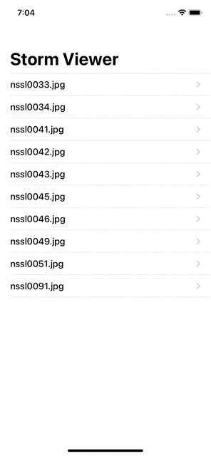
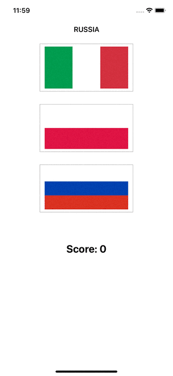
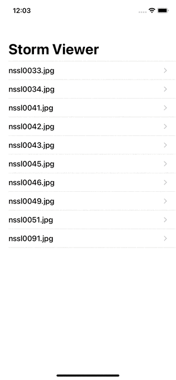
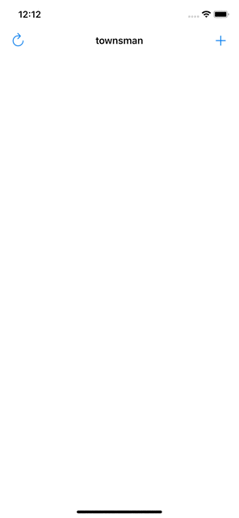
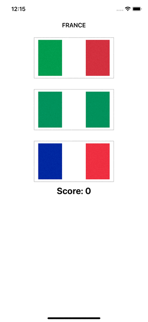
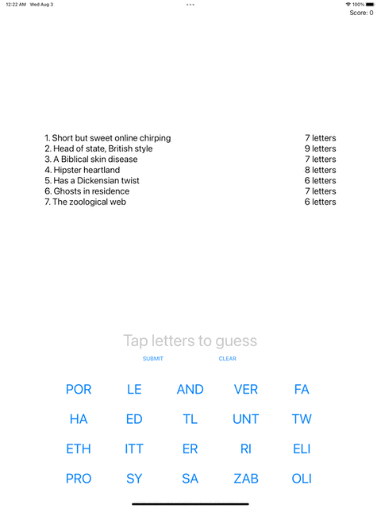

# 100 Days of Swift

 This repo contains my Swift projects from Paul Hudson's awesome Hacking With Swift tutorial series.\
30 projects using **UIKit**.

https://www.hackingwithswift.com/100

| Project | App            | Description           | Type      | Preview                                                |
| :-----: | -------------- | --------------------- | --------- | ------------------------------------------------------ |
|    1    | StormViewer    | Image viewer in Swift | App       |   |
|    2    | Guess the Flag | Swift UIKit game      | Game      |   |
|    3    | StormViewer    | Social Update         | Technique |   |
|    4    | SwiftBrowser   | Simple Web browser    | App       |   |
|    5    | WordScramble   | Word scramble game    | Game      |   |
|    6    | Guess the Flag | Auto Layout updates   | Technique |   |
|    7    | Whitehouse     | JSON Parsing          | App       |   |
|    8    | 7 Swifty Words | Word guessing         | Game      |   |
|    9    | Whitehouse     | GCD app update        | Technique |   |
|   10    | Names to Faces | Photo Library         | App       |  |

<!-- |   11    | Pachinko        | SpriteKit             | 2D Game   |                                                       | -->
<!-- |   12    | Names to Faces  | Add NSUserDefaults    | Technique |                                                       | -->
<!-- |   13    | Instafilter     | Core Image filters    | App       |                                                       | -->
<!-- |   14    | Whack-a-Penguin | Whack a mole clone    | Game      |                                                       | -->
<!-- |   15    | Animation       | Core Animation        | Technique |                                                       | -->
